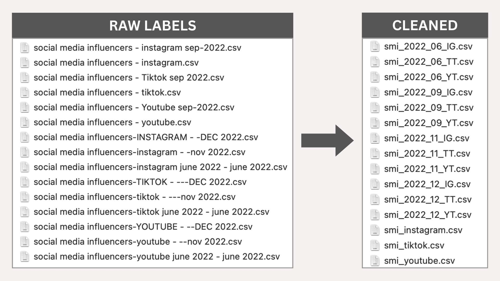

# Social Media Influencers of 2022
Data Visualization Project

SOURCE: https://www.kaggle.com/datasets/ramjasmaurya/top-1000-social-media-channels

## Data Cleaning:

### 1. Renamed datasets into a uniformed nomenclature

| Platform | Shortcut | Uniformed Nomenclature |
|----------|----------|------------------------|
| Instagram | IG | smi_YYYY_MM_IG.csv |
| TikTok | TT | smi_YYYY_MM_TT.csv |
| YouTube | YT | smi_YYYY_MM_YT.csv |

